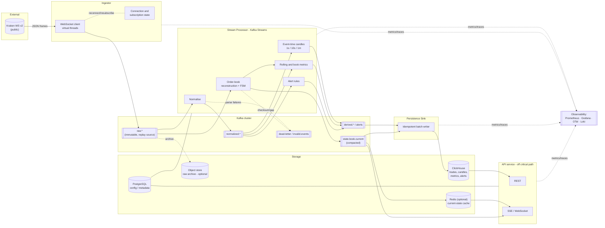
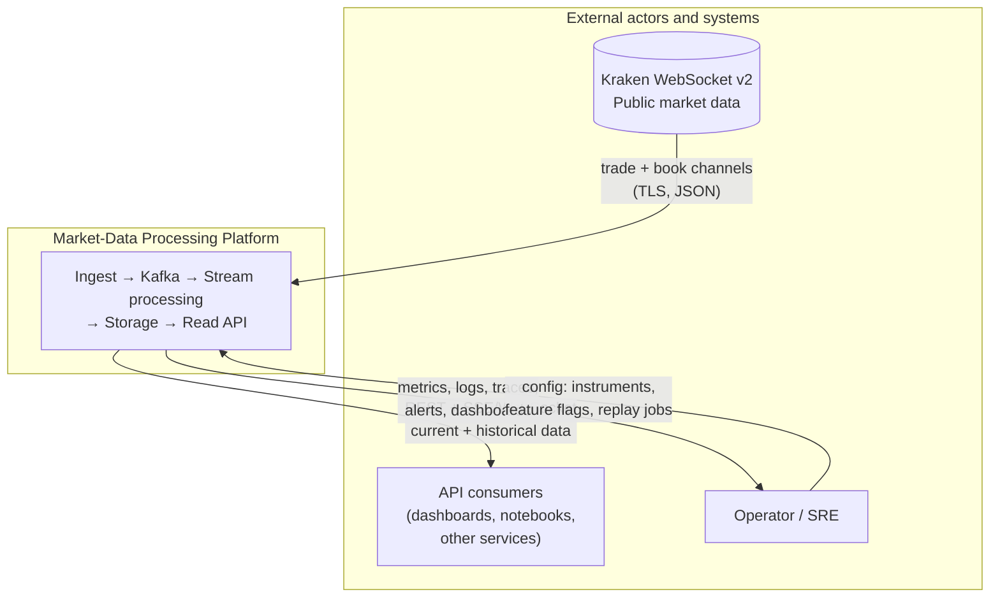
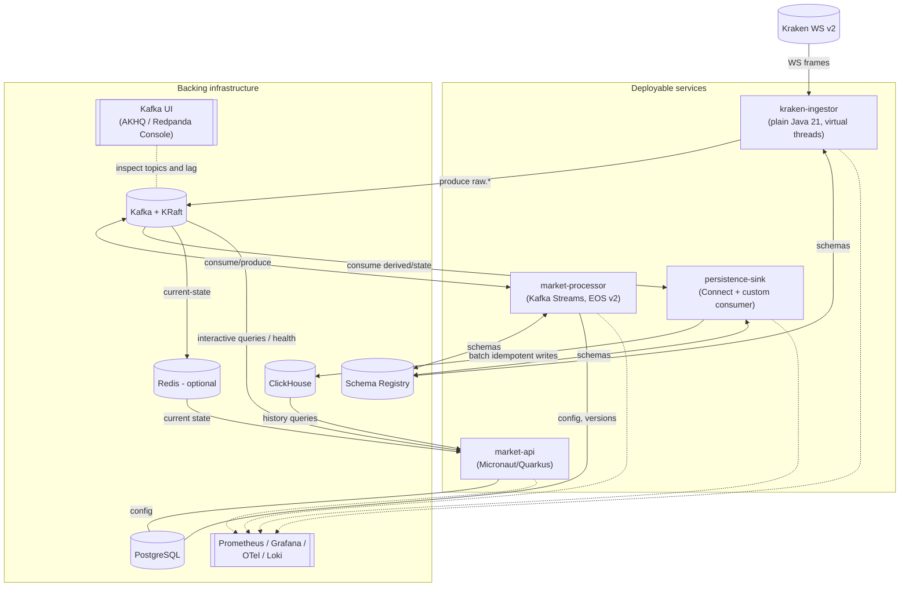
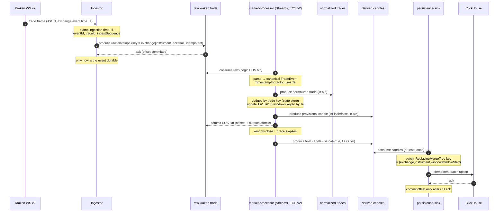
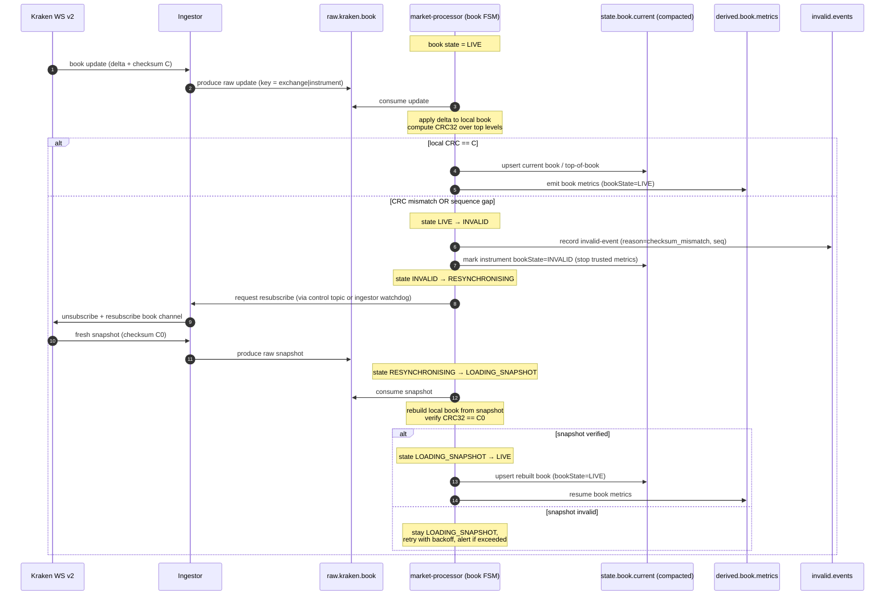
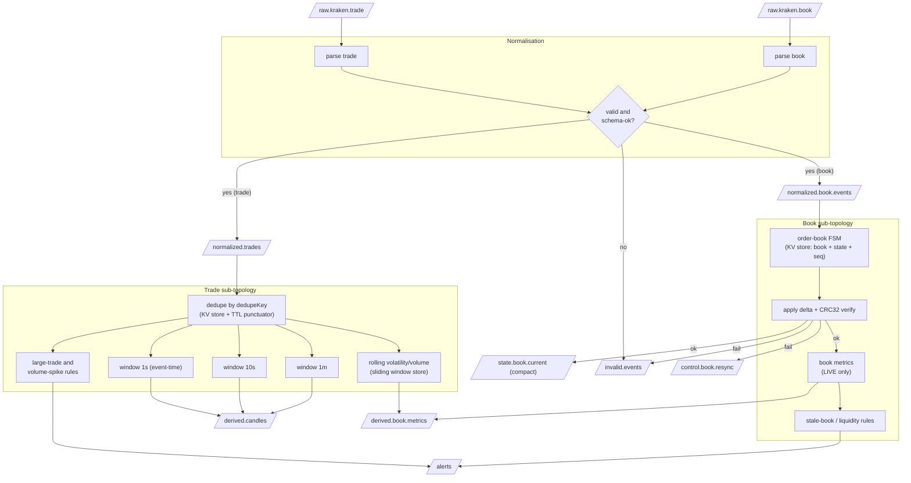
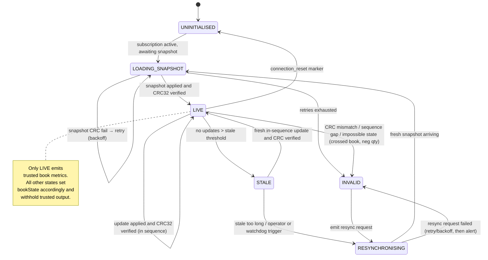
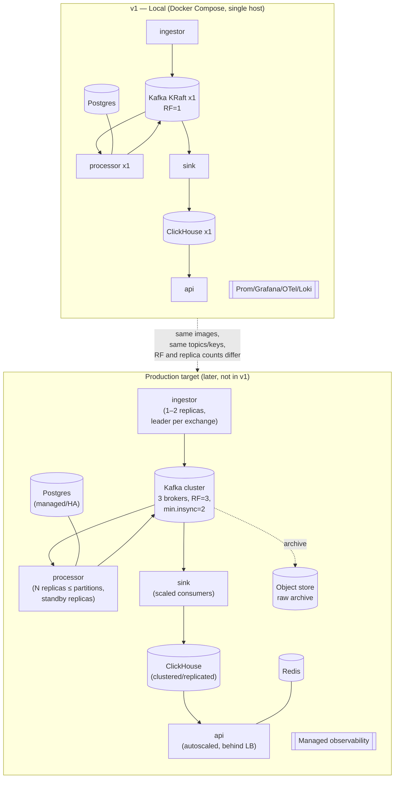

# Real-Time Market-Data Processing Platform — Technical Design

**Sources:** Kraken WebSocket v2 public channels · **Stack:** Java 21, Kafka, Kafka Streams
**Status:** Design (pre-implementation) · **Audience:** senior engineering / system-design review
**Scope of v1:** BTC/USD and ETH/USD, single-node local deployment, architecture credible for multi-market / multi-exchange growth.

---

## Table of contents

1. [Executive summary](#1-executive-summary)
2. [Goals](#2-goals)
3. [Non-goals](#3-non-goals)
4. [Assumptions](#4-assumptions)
5. [High-level architecture](#5-high-level-architecture)
6. [Component responsibilities](#6-component-responsibilities)
7. [System context diagram](#7-system-context-diagram)
8. [Container / service diagram](#8-container--service-diagram)
9. [Trade ingestion sequence diagram](#9-trade-ingestion-sequence-diagram)
10. [Order-book recovery sequence diagram](#10-order-book-recovery-sequence-diagram)
11. [Kafka topic design](#11-kafka-topic-design)
12. [Event schemas](#12-event-schemas)
13. [Processing topology](#13-processing-topology)
14. [Order-book state model](#14-order-book-state-model)
15. [Storage design](#15-storage-design)
16. [API design](#16-api-design)
17. [Scaling model](#17-scaling-model)
18. [Reliability and failure handling](#18-reliability-and-failure-handling)
19. [Delivery semantics](#19-delivery-semantics)
20. [Replay strategy](#20-replay-strategy)
21. [Observability](#21-observability)
22. [Security](#22-security)
23. [Testing strategy](#23-testing-strategy)
24. [Local development environment](#24-local-development-environment)
25. [Deployment model](#25-deployment-model)
26. [Phased implementation plan](#26-phased-implementation-plan)
27. [Key trade-offs](#27-key-trade-offs)
28. [Open questions](#28-open-questions)
29. [Recommended first implementation milestone](#29-recommended-first-implementation-milestone)

---

## 1. Executive summary

This platform ingests Kraken's public WebSocket v2 feed for a small set of crypto markets, turns each raw message into an immutable Kafka event, normalises it into an exchange-agnostic canonical model, and derives real-time market metrics — trade candles, VWAP, rolling statistics, order-book spread/depth/imbalance — using Kafka Streams. Derived data is copied to a columnar time-series store for historical querying, and a read-only API exposes both current state and history without ever sitting in the ingestion path.

The design is built around four principles:

1. **Kafka is the source of truth.** Every downstream artifact — candles, metrics, alerts, the analytical database — is a deterministic function of the raw event log. This makes replay, reprocessing, and A/B comparison of processor versions first-class rather than bolted on.
2. **Correctness is explicit and observable.** Order books are governed by a formal state machine; the processor refuses to publish trusted metrics whenever the local book cannot be verified against Kraken's checksum. Late, duplicate, and out-of-order events are handled deliberately, not implicitly.
3. **A small number of clearly separated components.** Four deployables — *Ingestor*, *Stream Processor*, *Persistence Sink*, *API* — not a microservice swarm. Each has one job and a clean Kafka boundary.
4. **Simple first, but not a dead end.** Every early simplification (single broker, RF=1, two markets, one processor instance) has a documented evolution path that does not require a rewrite. The keying and schema decisions in particular are made *once, now* to carry the system to multi-exchange scale.

The single most important design decision is **keying every event by `(exchange, instrument)`**. This gives per-order-book ordering on a single partition (a hard requirement for correct book reconstruction), makes each book independently parallelisable, and generalises cleanly to more markets and exchanges. Its cost — a high-volume market can become a hot partition that cannot be split without breaking ordering — is a known and bounded limitation, addressed in [§17](#17-scaling-model).

The recommended v1 stack is **Java 21 + Kafka + Kafka Streams + Avro + Confluent Schema Registry + ClickHouse (analytical) + PostgreSQL (config) + Docker Compose**, with Prometheus/Grafana/OpenTelemetry for observability. Rationale and alternatives for each are given inline.

---

## 2. Goals

- Ingest Kraken WebSocket v2 **trade** and **Level-2 book** channels for BTC/USD and ETH/USD with no silent data loss.
- Publish **immutable raw events** to Kafka before any transformation, so the log is the replayable system of record.
- Normalise Kraken messages into **canonical, exchange-agnostic** schemas with explicit event/ingestion/processing time and decimal-safe prices.
- Reconstruct and maintain **verified local order books** from snapshot + incremental updates, validated by Kraken's checksum.
- Compute **trade-derived** metrics (OHLCV, VWAP, buy/sell volume, trade count, rolling volume, rolling volatility, large-trade and volume-spike detection) over **1s / 10s / 1m** event-time windows.
- Compute **book-derived** metrics (best bid/ask, mid, spread, weighted mid, bid/ask depth, imbalance, liquidity change, stale-book detection).
- Detect and account for **invalid, missing, duplicate, late, and out-of-order** events.
- Store historical derived data for querying; expose current + historical data via an **API that is not on the processing critical path**.
- Support **replay** to rebuild derived state, test new processor versions, and reproduce historical alerts.
- Be **runnable end-to-end on a single developer machine** and **buildable by one engineer** in incremental phases.
- Be **opinionated and interview-defensible**: every major choice states a recommendation, a reason, an alternative, and when the alternative wins.

## 3. Non-goals

- **No trading, order placement, or private/authenticated Kraken channels.** Public market data only. (Kafka auth is still designed, because it is cheap and demonstrates good practice.)
- **No full second-exchange implementation.** Only the abstractions that let one be added later without rewriting the processing layer ([§26 Phase 5](#26-phased-implementation-plan)).
- **No Kraken-provided candles in the main flow.** Candles are derived from individual trades to demonstrate event-time windowing. Kraken candles may be used *only* as an offline correctness oracle in tests.
- **No user accounts / multi-tenant auth** beyond what protects the infrastructure. The API is read-only public data; rate limiting and transport security suffice for v1.
- **No multi-region / cross-datacentre replication, no Kubernetes for v1.** Production topology is sketched ([§25](#25-deployment-model)) but not built.
- **No sub-millisecond HFT latency target.** This is an analytics/observability platform; end-to-end latency in the tens-to-hundreds of milliseconds is acceptable.
- **No guarantee that an external side effect (DB write, notification) is literally exactly-once.** We achieve *effectively-once* via idempotent writes; the distinction is made explicit in [§19](#19-delivery-semantics).

## 4. Assumptions

- Kraken WS v2 delivers, per instrument, a `snapshot` message followed by ordered incremental `update` messages, each carrying a **CRC32 checksum** of the top-of-book state that the client must independently reproduce. A checksum mismatch means the local book has diverged and must be rebuilt from a fresh snapshot.
- Trade messages carry an exchange-assigned **timestamp** and enough identity to derive a stable trade key. Where a stable exchange trade ID is unavailable, a deterministic composite key `(instrument, timestamp, price, qty, side, ordinal)` is used for deduplication.
- Message volume for two crypto majors is modest (order of **10²–10³ messages/sec aggregate** in bursts), comfortably within a single-broker, single-processor-instance local deployment. The design must nonetheless *behave correctly* under bursts and degrade predictably.
- One developer builds this over several phases; each phase is independently demonstrable.
- Wall-clock skew between the developer machine and Kraken is small but **not trusted** — event time comes from exchange timestamps, never the local clock.
- Local infra runs under Docker Compose. Production numbers (RF=3, `min.insync.replicas=2`, multiple brokers) are documented as the target but not required to run v1.

---

## 5. High-level architecture

Data flows strictly left-to-right through Kafka. Nothing downstream ever calls back into ingestion; every stage's only input is a Kafka topic and its only durable output is another Kafka topic (or, at the edges, a database).



**Reading the diagram.** The Ingestor is deliberately *dumb*: it authenticates the transport, subscribes, and shovels raw frames into `raw.*` with minimal logic, because the more logic lives in the ingestor the harder replay becomes. All interpretation — normalisation, book reconstruction, windowing, alerting — happens in the Stream Processor, which reads only from Kafka and writes only to Kafka. The Sink and API are pure readers. This is what keeps the API off the critical path: if the API or ClickHouse is down, ingestion and processing continue and simply build up a (bounded, monitored) backlog.

---

## 6. Component responsibilities

The system has **four deployable services** plus shared infrastructure. This is a deliberate rejection of fine-grained microservices: normalisation, book reconstruction, and metric computation are one cohesive stateful topology and splitting them across services would multiply serialization cost, operational surface, and failure modes for no benefit at this scale.

### 6.1 Ingestor (`kraken-ingestor`)

**One job:** maintain healthy Kraken WS connections and publish raw frames verbatim to Kafka.

- Opens and supervises one (or few) WebSocket connections; subscribes to `trade` and `book` channels for configured instruments (config read from PostgreSQL / a config file).
- Wraps each received frame in a **raw envelope** (adds `eventId`, `receivedAt`, `sourceConnectionId`, monotonic `ingestSequence`, `traceId`) and produces to `raw.kraken.trade` / `raw.kraken.book`, **keyed by `(exchange, instrument)`**.
- Owns **connection lifecycle**: heartbeat/ping monitoring, reconnect with jittered backoff, resubscribe, and emission of a synthetic `connection_reset` marker so downstream book logic knows to expect a fresh snapshot.
- Does **not** parse book semantics, validate checksums, or maintain a book. It may do *light, optional* dedupe of obviously repeated frames but treats deduplication as a downstream responsibility.
- Java 21 **virtual threads**: one per connection for blocking read loops, plus a bounded producer path. I/O-bound work maps naturally onto virtual threads without a reactive framework.

**Recommendation:** keep the ingestor a plain Java app (no heavy framework) using the Kafka producer + a WS client (e.g. Java 11+ `HttpClient` WebSocket or `Tyrus`/`nv-websocket`). **Why:** minimal surface, fast startup, easy to reason about the exactly-what-was-received guarantee. **Alternative:** a Kafka Connect *source connector*. **When preferable:** if you later want zero-code operational management of many source connections and are willing to write/adopt a connector; for a bespoke stateful WS handshake (snapshot/resubscribe) a custom app is clearer.

### 6.2 Stream Processor (`market-processor`)

**One job:** turn raw events into normalised events, verified books, and derived metrics/alerts. This is the heart of the system and the only stateful, correctness-critical component.

- **Normalisation:** parse raw Kraken JSON → canonical `TradeEvent` / `BookSnapshot` / `BookUpdate`; route unparseable/invalid input to DLQ.
- **Order-book reconstruction:** apply snapshots and updates through the [state machine](#14-order-book-state-model), validate checksums, detect sequence gaps, and emit `state.book.current` + book metrics only while a book is `LIVE`.
- **Trade aggregation:** event-time windowed OHLCV/VWAP/volume/count over 1s/10s/1m; rolling volatility/volume via sliding windows.
- **Alerting:** large-trade and volume-spike detection; stale-book and liquidity-change alerts.
- **Deduplication:** stateful dedupe of trades by trade key and idempotent book-update application by sequence.

**Recommendation:** a single Kafka Streams application (one `application.id`) containing multiple sub-topologies. **Why:** shared exactly-once transactional context, one changelog/rebalance domain, one thing to deploy and scale by adding instances. **Alternative:** split into multiple Streams apps (e.g. book vs trades). **When preferable:** if book processing and trade processing develop very different scaling profiles or release cadences, splitting isolates their rebalances and state restoration — revisit in Phase 4.

### 6.3 Persistence Sink (`persistence-sink`)

**One job:** copy derived/current-state topics into ClickHouse **idempotently and in batches**, applying backpressure via Kafka lag rather than dropping data.

- Consumes `derived.candles`, `derived.book.metrics`, `alerts`, `normalized.trades`, and `state.book.current`.
- Batches writes; uses ClickHouse `ReplacingMergeTree` keyed by natural identity so replays overwrite rather than duplicate.
- On ClickHouse unavailability: **stop committing offsets, do not drop** — lag grows in Kafka (safe up to retention), alert fires.

**Recommendation:** start with the **ClickHouse Kafka Connect sink connector** where its semantics fit; fall back to a **small custom consumer** for the tables needing precise idempotency/batching control. **Why:** Connect removes boilerplate for the easy tables; a custom consumer gives explicit control where it matters. **Alternative:** ClickHouse's native **Kafka table engine** (ClickHouse consumes Kafka directly). **When preferable:** for the very simplest append-only tables where you want zero extra services — but it couples ingestion to ClickHouse config and is harder to test in isolation, so it is not the default here.

### 6.4 API service (`market-api`)

**One job:** serve current + historical data to clients, read-only, off the critical path.

- **Current state** (latest price, spread, imbalance) from a materialised view of `state.book.current` (via Redis cache or Kafka Streams *interactive queries* — see [§16](#16-api-design)).
- **History** (recent candles, historical metrics, alerts) from ClickHouse.
- **Health** (processor state, consumer lag, book states) from JMX/metrics endpoints.
- Live push via **SSE** (default) or WebSocket.

**Recommendation:** a lightweight framework — **Micronaut or Quarkus** (fast startup, low memory, native metrics/health, good Kafka integration). **Why:** the API benefits from DI/config/health/metrics scaffolding but should not drag in a heavy runtime. **Alternative:** **Spring Boot**. **When preferable:** if team familiarity and ecosystem breadth outweigh startup/footprint — a very defensible default in most shops. **Second alternative:** **Javalin** for a truly minimal REST+SSE surface if the API stays small.

### 6.5 Shared infrastructure

Kafka + Schema Registry (event transport & contracts), ClickHouse (analytical history), PostgreSQL (instrument config, schema/processor version registry, feature flags), optional Redis (hot current-state cache for API fan-out), optional object store (long-term raw archive), and the observability stack (Prometheus, Grafana, OpenTelemetry collector, Tempo/Jaeger, Loki).

---

## 7. System context diagram

The platform sits between one external system (Kraken) and two consumer classes (interactive API clients and the operator). It has no other external dependencies in v1.



**Boundary rationale.** The only inbound data dependency is Kraken. The operator interacts through configuration (which markets to subscribe, which processor version is live, when to run a replay) and through observability, never by touching the data path directly. Keeping consumers strictly on the read side is what allows the API to be scaled, restarted, or overwhelmed without endangering ingestion.

---

## 8. Container / service diagram

Four deployable services and their backing stores. Arrows show the direction of data dependency (who reads from / writes to what).



**Why exactly these four.** Each service owns a distinct failure and scaling domain: the ingestor's risk is connection health; the processor's is state and correctness; the sink's is external-write throughput/backpressure; the API's is read fan-out. Merging any two would couple unrelated failure modes (e.g. an API traffic spike must never be able to stall book reconstruction). Splitting further — separate services per metric family — would fragment the shared Streams state and transactional boundary for no operational gain at this scale.

---

## 9. Trade ingestion sequence diagram

Happy path for a single trade, from Kraken frame to a finalised candle and a stored row. Note where each timestamp is stamped and where the exactly-once boundary begins and ends.



**Key points.**
- **Durability boundary:** the event is not considered received until Kafka acks the raw produce (step 3–4). If the ingestor crashes before this ack, the frame is lost from Kafka's perspective — this is the one unavoidable at-most-once window, discussed in [§18 scenario 2](#18-reliability-and-failure-handling) and [§19](#19-delivery-semantics).
- **EOS scope:** steps 6–11 are one Kafka transaction — consume-offset + normalized output + candle output commit atomically. A crash mid-transaction rolls back cleanly; no partial candle escapes.
- **Provisional vs final:** a candle is emitted repeatedly as trades arrive (`isFinal=false`) for live UX, then once more after grace (`isFinal=true`). The sink's upsert key means the final row overwrites the provisional one.
- **The sink is not in the EOS transaction.** Kafka→ClickHouse is at-least-once + idempotent upsert = *effectively once* ([§19](#19-delivery-semantics)).

---

## 10. Order-book recovery sequence diagram

The hard case: a live book detects a checksum failure (equivalently: a sequence gap) and must resynchronise without publishing untrustworthy metrics in the meantime.



**Key points.**
- **Fail closed.** The instant the book cannot be verified, `bookState` flips to `INVALID` and the processor stops emitting trusted metrics for that instrument. Consumers see the state flag and know not to trust stale numbers. This is the single most important correctness behaviour of the book pipeline.
- **Resubscribe channel.** How the processor asks the ingestor to resubscribe is a decision ([§14](#14-order-book-state-model)): a dedicated `control.book.resync` Kafka topic the ingestor consumes, or an ingestor-side watchdog that resubscribes when it sees no book activity. The Kafka control topic is recommended because it keeps the processor authoritative about *when* a book is untrustworthy while keeping the ingestor authoritative about the *connection*.
- **Other markets are unaffected.** Because each book is keyed independently, an INVALID BTC/USD book does not stop ETH/USD metrics.

---

## 11. Kafka topic design

### 11.1 Guiding decisions

**Separate topics by event *category* and *lifecycle*, not by market.** Markets (and later, exchanges) are distinguished by the **partition key**, not by topic. Per-market topics would explode topic/partition count (2 markets × N event types today, but 100s later), fragment consumer assignment, and make cross-market processing awkward — all for no ordering benefit, since ordering is a per-partition property that keying already provides.

**Separate raw / normalized / derived.** These have different schemas, retention needs, trust levels, and replay roles:
- **raw** is the immutable replay source of truth — never mutated, longest retention that storage allows.
- **normalized** is a cheap, canonical intermediate — short retention, always rederivable from raw.
- **derived** is the product — retention tuned to how long consumers need it in Kafka before ClickHouse becomes the query surface.

**Separate by exchange in the name from day one** (`raw.kraken.*`), even with one exchange, so adding `raw.coinbase.*` later is additive, not a rename.

### 11.2 Topic catalogue (initial local deployment)

| Topic | Category | Key | Partitions | Cleanup | Retention | Notes |
|---|---|---|---|---|---|---|
| `raw.kraken.trade` | raw | `exchange\|instrument` | 6 | delete | 7–30 d | Replay source of truth; longest affordable retention |
| `raw.kraken.book` | raw | `exchange\|instrument` | 6 | delete | 7–30 d | Snapshots + updates + `connection_reset` markers |
| `normalized.trades` | normalized | `exchange\|instrument` | 6 | delete | 3–7 d | Rederivable from raw |
| `normalized.book.events` | normalized | `exchange\|instrument` | 6 | delete | 3–7 d | Canonical snapshot/update union |
| `derived.candles` | derived | `exchange\|instrument` | 6 | delete | 7–14 d | `window` is a field; final rows copied to ClickHouse |
| `derived.book.metrics` | derived | `exchange\|instrument` | 6 | delete | 3–7 d | Spread/depth/imbalance stream |
| `state.book.current` | state | `exchange\|instrument` | 6 | **compact** | — | Latest verified book / top-of-book per instrument |
| `alerts` | derived | `exchange\|instrument` | 6 | delete | 30 d | Large-trade, volume-spike, stale-book, liquidity |
| `invalid.events` | ops | `exchange\|instrument` | 3 | delete | 14 d | Schema/validation/checksum failures with reason |
| `dead-letter` | ops | original key | 3 | delete | 14 d | Unroutable/unparseable frames; carries original bytes |
| `control.book.resync` | control | `exchange\|instrument` | 3 | delete | 1 d | Processor → ingestor resubscribe requests |

Kafka Streams also creates **internal changelog and repartition topics** automatically (`<app-id>-<store>-changelog`, compacted). These are not in the catalogue but are covered in [§13](#13-processing-topology)/[§18](#18-reliability-and-failure-handling).

### 11.3 Partition count

**Recommendation: 6 partitions** for the data topics locally. **Why:** with only 2 instruments you need at least 2 for parallelism, but 6 (a) lets you demonstrate rebalancing across 2–3 processor instances, (b) leaves headroom to add ~4 more markets without repartitioning, and (c) is a small, round number that keeps changelog/repartition overhead trivial. Ops topics get 3 — they are low volume.

**Why not more:** partitions are not free — each adds file handles, changelog partitions, and rebalance cost, and you can never *reduce* partition count without recreating the topic (which breaks key→partition stability and thus replay determinism). Over-provisioning partitions is a common and costly mistake.

**Alternative:** 3 partitions. **When preferable:** if you never intend to run more than one processor instance locally and want the absolute simplest setup for Phase 1. You can raise to 6 later *only* by accepting that historical keys may remap — so decide before you accumulate replay-critical history.

### 11.4 Partition key

**Every data topic is keyed by `exchange|instrument`** (e.g. `KRAKEN|BTC/USD`). This is the linchpin decision:
- Guarantees **per-book / per-market ordering** on a single partition (Kafka orders within a partition only).
- Keeps **all updates for one order book co-located**, which is mandatory for sequence-correct reconstruction.
- Distributes markets across partitions for parallelism.
- **Generalises to multi-exchange** unchanged — the key already namespaces by exchange.

The key is a stable string; the partitioner is the default murmur2 hash. Do **not** use a custom range partitioner — hash distribution is fine and keeps behaviour predictable across topics.

### 11.5 Compaction vs deletion

- **Delete (time retention):** raw, normalized, derived streams, alerts, ops topics. These are event streams where history matters for a bounded window and is then aged out (raw/derived) or copied to ClickHouse.
- **Compact:** `state.book.current` — a *table* of latest-per-key, where only the newest value per instrument matters; compaction bounds its size regardless of update rate.
- **Compact (internal):** Streams changelogs are compacted automatically so restoration replays only the latest state per key.

### 11.6 Replication

**Local: RF=1** (single broker) — acknowledged as non-durable to broker loss; acceptable because the local box is disposable and raw can be re-ingested.
**Production target: RF=3, `min.insync.replicas=2`, producer `acks=all`.** This is documented in [§25](#25-deployment-model) and referenced by the security/reliability sections; the *code and config* are written to the production values with RF overridable per environment, so promoting to a real cluster is a config change, not a rewrite.

### 11.7 Dead-letter and invalid-event topics

Two ops topics, deliberately distinct:
- **`invalid.events`** — *structured* failures the system understood well enough to categorise: schema-invalid payloads, checksum mismatches, sequence gaps, impossible book states, out-of-grace late events (sampled). Carries `stage`, `reason`, `errorClass`, original key, and a payload reference. This is the analytical DLQ — you query it to understand data-quality issues.
- **`dead-letter`** — *unparseable* frames the system could not even categorise (e.g. malformed JSON, unknown message type). Carries the raw bytes for forensic replay.

Both are monitored: any nonzero rate is an alert-worthy signal ([§21](#21-observability)).

---

## 12. Event schemas

### 12.1 Serialization format

**Recommendation: Avro + Confluent Schema Registry.** **Why:** Avro is the best-integrated format in the Kafka/Confluent ecosystem, has compact binary encoding, a mature schema-evolution model (with registry-enforced compatibility), and first-class support in Kafka Streams SerDes. The registry gives us a central, versioned contract and prevents a schema-incompatible producer from poisoning consumers ([§18 scenario 12](#18-reliability-and-failure-handling)).

**Alternative: Protobuf** (also Schema-Registry-supported). **When preferable:** if you want ergonomic multi-language codegen and are likely to consume events from Go/TypeScript services, or if you plan gRPC APIs — Protobuf's tooling is nicer there. Protobuf's evolution rules are also very forgiving. For a Java-centric, Kafka-Streams-centric project, Avro's tighter Streams/registry integration wins; the schemas below map 1:1 to Protobuf if that call is reversed.

**Decimal representation.** Prices and quantities use the **Avro `decimal` logical type** (`bytes` + `precision`/`scale`), deserialised to Java `BigDecimal`. **Never `float`/`double`.** **Why:** binary floating point cannot represent decimal prices exactly, and rounding drift is unacceptable in market data (VWAP, checksums, imbalance all compound errors). **Alternative:** fixed-scale integers (price in minor units as `long`). **When preferable:** if you need maximum arithmetic speed and control scale rigorously per instrument; the risk is silent scale mismatches across instruments with different tick sizes, so `decimal` logical type is the safer default. As a pragmatic middle ground, prices may be *carried* as a canonical string in the raw envelope and converted to `decimal` at normalisation.

### 12.2 Common fields (every canonical event)

Every normalized/derived event carries a standard header so that identity, time, lineage, and evolution are uniform:

| Field | Type | Meaning |
|---|---|---|
| `eventId` | UUID (string) | Unique ID for *this* event, assigned at creation |
| `exchange` | enum/string | `KRAKEN` (extensible) |
| `instrument` | string | Canonical symbol, e.g. `BTC/USD` |
| `eventTime` | timestamp-millis | **Exchange** event time (the authoritative business time) |
| `ingestionTime` | timestamp-millis | When the ingestor received the frame |
| `processingTime` | timestamp-millis | When the processor produced this event (set on derived) |
| `eventTimeSource` | enum | `EXCHANGE` \| `INGESTION_FALLBACK` (see clock-skew handling, [§ event time]) |
| `schemaVersion` | int | Logical schema version, complements the registry ID |
| `traceId` / `correlationId` | string | Propagated from the raw envelope for end-to-end tracing |
| `sourceEventId` | UUID | The raw/upstream event this was derived from (lineage) |

Below, only the *distinctive* fields per schema are listed; assume the common header unless noted.

### 12.3 Raw exchange event envelope (`raw.kraken.*`)

The envelope is intentionally **opaque about payload semantics** — it stores the original frame so replay is byte-faithful.

```
RawEnvelope {
  eventId: UUID
  exchange: string            // KRAKEN
  channel: string             // "trade" | "book"
  instrument: string          // parsed from frame for keying; best-effort
  receivedAt: timestamp-millis   // ingestion time
  sourceConnectionId: string  // which WS connection delivered this
  ingestSequence: long        // monotonic per connection; gap = ingestor restart
  payload: bytes              // original frame, verbatim (UTF-8 JSON)
  payloadEncoding: string     // "json"
  traceId: string
  schemaVersion: int
}
```

Notes on identity/time: the envelope has **no exchange event time yet** (it is inside `payload`); `receivedAt` is the ingestion time. `ingestSequence` lets us detect ingestor restarts and gaps independent of exchange sequence.

### 12.4 Normalized trade event (`normalized.trades`)

```
TradeEvent {
  <common header>
  tradeId: string            // exchange trade id if present, else deterministic composite
  price: decimal(38,18)
  quantity: decimal(38,18)
  side: enum { BUY, SELL }    // aggressor side
  dedupeKey: string          // instrument|tradeId  (or composite) — used by dedupe store
}
```

`eventTime` = Kraken trade timestamp. `dedupeKey` is explicit so the dedupe store and any idempotent sink share one definition.

### 12.5 Order-book snapshot (`normalized.book.events`, type=SNAPSHOT)

```
BookSnapshot {
  <common header>
  bids: array<Level>          // Level { price: decimal, quantity: decimal }
  asks: array<Level>
  checksum: long              // Kraken CRC32 for the snapshot
  depth: int                  // number of levels (e.g. 10/25/100/500/1000)
  sequenceAnchor: long        // update id / seq this snapshot is valid as-of, if provided
}
```

### 12.6 Order-book update (`normalized.book.events`, type=UPDATE)

```
BookUpdate {
  <common header>
  bidDeltas: array<Level>     // quantity 0 = remove level
  askDeltas: array<Level>
  checksum: long              // Kraken CRC32 AFTER applying this update
  sequence: long              // update ordering identifier
  prevSequence: long          // expected predecessor (gap detection), if derivable
}
```

Ordering/identity: `sequence` (and `prevSequence` where available) drives gap detection and idempotent application. `checksum` is verified after application. A `connection_reset` marker (a synthetic update with a distinguished type) tells the FSM to expect a fresh snapshot.

### 12.7 Candle (`derived.candles`)

```
Candle {
  <common header>            // eventTime = windowStart
  window: enum { S1, S10, M1 }
  windowStart: timestamp-millis
  windowEnd: timestamp-millis
  open: decimal  high: decimal  low: decimal  close: decimal
  volume: decimal            // base-asset volume
  quoteVolume: decimal       // for VWAP denominator convenience
  vwap: decimal
  buyVolume: decimal  sellVolume: decimal
  tradeCount: int
  isFinal: boolean           // false = provisional (interim), true = window closed past grace
  inputTradeCount: int       // trades actually folded (for late-arrival auditing)
}
```

### 12.8 Order-book metric (`derived.book.metrics`)

```
BookMetric {
  <common header>            // eventTime = time of the book update that produced it
  bookState: enum { LIVE, INVALID, STALE, LOADING, RESYNCHRONISING, UNINITIALISED }
  bestBid: decimal  bestAsk: decimal
  midPrice: decimal
  spread: decimal  spreadBps: decimal
  weightedMidPrice: decimal  // size-weighted top-of-book mid
  bidDepthN: decimal  askDepthN: decimal   // summed quantity within N levels / price band
  depthLevels: int
  imbalance: decimal         // (bidDepth - askDepth) / (bidDepth + askDepth), [-1, 1]
  checksumVerified: boolean
}
```

Only `bookState=LIVE` metrics are "trusted"; the field is always present so consumers can filter.

### 12.9 Alert (`alerts`)

```
Alert {
  <common header>
  alertId: UUID
  type: enum { LARGE_TRADE, VOLUME_SPIKE, STALE_BOOK, LIQUIDITY_DROP }
  severity: enum { INFO, WARN, CRITICAL }
  triggeredAt: timestamp-millis    // event time of trigger
  windowRef: string?               // window/instrument context if applicable
  dedupeKey: string                // stable key to suppress duplicate alerts
  details: map<string,string>      // rule-specific context (threshold, observed, z-score…)
  processorVersion: string         // which build/version raised it (auditability)
}
```

`dedupeKey` + `processorVersion` make alerts idempotent and auditable — you can reproduce exactly which logic version fired ([§20](#20-replay-strategy)).

### 12.10 Invalid event (`invalid.events` / `dead-letter`)

```
InvalidEvent {
  eventId: UUID
  occurredAt: timestamp-millis
  stage: enum { INGEST, NORMALIZE, BOOK_APPLY, WINDOW, ALERT, SINK }
  reason: enum { SCHEMA_INVALID, PARSE_ERROR, CHECKSUM_MISMATCH,
                 SEQUENCE_GAP, IMPOSSIBLE_STATE, LATE_BEYOND_GRACE, UNKNOWN_TYPE }
  errorClass: string
  originalTopic: string
  originalKey: string
  originalPayload: bytes      // enough to forensically replay / diagnose
  instrument: string?
  traceId: string
  processorVersion: string
}
```

---

## 13. Processing topology

The Stream Processor is a single Kafka Streams application (`application.id = market-processor`, one topology, several sub-flows). Running it as one app gives a shared **exactly-once (EOS v2)** transactional context and one rebalance/changelog domain.



### 13.1 Event time vs ingestion time vs processing time

- **Event time (`eventTime`)** — the exchange's timestamp for when the trade/quote actually happened. **This is the authoritative time for all windowing.** A custom `TimestampExtractor` returns `eventTime` for every record.
- **Ingestion time (`ingestionTime`)** — when the ingestor received the frame. Used for latency measurement and as the fallback when event time is missing/absurd.
- **Processing time (`processingTime`)** — when the processor emitted a derived record. Used only for observability (end-to-end latency = `processingTime − eventTime`), never for windowing.

**Window assignment.** A trade is assigned to windows by its `eventTime`. For a 1-minute window, a trade at `12:00:03.4` belongs to the `[12:00:00, 12:01:00)` window regardless of when it is processed. Windows are **wall-clock-aligned tumbling windows** (advance = size) for candles; rolling metrics use **sliding/hopping windows**.

**Grace periods.** Each window has a grace period after which it is closed and, with `suppress()`, its **final** result is emitted:

| Window | Grace | Rationale |
|---|---|---|
| 1s | 2 s | Tight; 1s candles are for live feel, minor late loss acceptable |
| 10s | 5 s | Balance latency vs completeness |
| 1m | 15–30 s | Most tolerant; 1m candles are the "storage of record" candle |

> **Finding from M3 (2026-08-29) — finalisation is driven by stream time, not the wall clock.**
>
> `suppress(untilWindowCloses)` releases a window's final result only when a *later record*
> advances stream time past `windowEnd + grace`. Nothing emits on a timer. The practical
> consequence: on a quiet instrument the most recent window stays unfinalised — indefinitely,
> if it never trades again — and the phrase "after which it is closed" above should be read
> as "after which the next trade closes it".
>
> This is a deliberate trade-off, not an oversight. A wall-clock punctuator would close
> windows promptly and make the output depend on *when* the job ran, which breaks
> correctness invariant 6 (§23.5) and would leave the deterministic fixture test unable to
> pass at all. Correct-and-late beats timely-and-irreproducible.
>
> Observed cost on the Phase 1 instruments is seconds: BTC/USD and ETH/USD trade often
> enough that the next trade is never far away. It matters for thinly traded markets, and
> the honest mitigation there is a synthetic stream-time heartbeat on the input topic
> (a record that advances time without contributing to any aggregate) rather than a
> punctuator — revisit if Phase 5 adds an illiquid instrument.

**Late event after window close.** If a trade arrives with `eventTime` inside a window that has already closed *plus grace*:
- It is **excluded** from that window's aggregate (the final candle stands).
- It is **counted** in a `late_events_total` metric and **sampled** to `invalid.events` (reason `LATE_BEYOND_GRACE`) for analysis.
- It is **not** silently dropped without record.

**Can emitted metrics be corrected?** Two-tier answer:
- **Provisional (`isFinal=false`)** results are emitted continuously as trades fold in; they are expected to change and are explicitly marked non-authoritative.
- **Final (`isFinal=true`)** results are emitted once, after grace, and are treated as immutable in ClickHouse. We deliberately **do not** revise finalised candles for very-late trades — doing so would make historical data non-reproducible and confuse consumers. Very-late trades are instead surfaced as a data-quality signal. (If a business need for correction ever arises, the replay mechanism ([§20](#20-replay-strategy)) can regenerate a corrected version into a *versioned* topic rather than mutating the original.)

**Clock skew and missing timestamps.**
- Reject/repair **absurd** event times: if `eventTime` is more than a bounded threshold in the future or past relative to `ingestionTime` (e.g. > 60 s future, > 24 h past), treat it as suspect → fall back to `ingestionTime`, set `eventTimeSource = INGESTION_FALLBACK`, and count it.
- **Missing** event time → same fallback path.
- We never trust the *local* processor clock for event time; only exchange time or the ingestor's `receivedAt` are used, both stamped upstream of windowing.

### 13.2 Deduplication

Duplicates can enter from several places; each is handled at the layer where it can be detected exactly:

| Source of duplication | Layer handled | Mechanism |
|---|---|---|
| Duplicate WebSocket frames from Kraken | Ingestion (optional) / Normalisation | Best-effort ingestor suppression; authoritative dedupe by `dedupeKey` in processor |
| Replayed Kafka records / consumer retries | Processing | Kafka Streams **EOS v2** makes read-process-write idempotent within Kafka |
| Duplicate external trade IDs | Normalisation/Processing | KV **dedupe store** keyed by `dedupeKey`; if seen within TTL → drop, count `duplicate_events_total` |
| Order-book update applied twice | Processing | **Sequence-based idempotency**: apply only if `sequence` advances the book; already-applied/older sequences are ignored |
| Duplicate writes to ClickHouse | Sink | **Idempotent upsert** (`ReplacingMergeTree` on natural key) |

**Where deduplication lives — recommendation:** **multi-layer, but with a single authoritative layer per concern.** Trade-ID dedupe is authoritative in the **processor** (a stateful KV store with a TTL punctuator that evicts keys older than the largest window + grace, keeping the store bounded). Book-update idempotency is authoritative in the **processor** via sequence tracking. The **sink** is idempotent so that Kafka's at-least-once delivery to ClickHouse (and any replay) cannot create duplicate rows. Ingestion-level dedupe is *optional* and best-effort only — it must never be relied upon for correctness because the ingestor is deliberately dumb and horizontally restartable.

**Why not dedupe only at the sink?** Because duplicate trades would corrupt *in-Kafka* aggregates (candle volume, VWAP) long before reaching ClickHouse. Dedupe must precede aggregation.

### 13.3 Stateful processing and state stores

| State store | Type | Key | Contents | Changelog |
|---|---|---|---|---|
| `book-state` | KV (RocksDB) | `exchange\|instrument` | full book (sorted price→qty maps), FSM state, last sequence, last checksum, last-update time | compacted |
| `trade-dedupe` | KV | `dedupeKey` | seen-marker + timestamp (TTL-evicted) | compacted |
| `candle-1s/10s/1m` | Windowed | `exchange\|instrument` + window | running OHLCV/VWAP accumulators | compacted |
| `rolling-metrics` | Windowed/sliding | `exchange\|instrument` | rolling volume, return series for volatility | compacted |
| `last-seen` | KV | `exchange\|instrument` | last event time, last book-update time (stale detection) | compacted |
| `seq-tracking` | KV | `exchange\|instrument` | expected next book sequence | compacted |

- **Changelog topics.** Every store is backed by a compacted changelog topic (`market-processor-<store>-changelog`). Writes to a store are also written to its changelog inside the EOS transaction, so state and offsets stay consistent.
- **Local state restoration.** On startup/rebalance, an instance restores each assigned store from its changelog into local RocksDB **before** processing that partition. This is the expensive step for the (potentially large) `book-state` store.
- **Rebalancing.** Use the **cooperative-sticky assignor** so only moved partitions are revoked, plus **static group membership** (`group.instance.id`) so a rolling restart does not trigger a full reshuffle. This minimises how much state must migrate.
- **Standby replicas.** Set `num.standby.replicas = 1` (once >1 processor instance exists) so a warm copy of each store is maintained elsewhere; failover then promotes the standby instead of restoring from scratch — critical for the large `book-state` store.
- **Recovery after a crash.** The crashed instance's partitions are reassigned; the new owner either promotes a standby (fast) or restores from changelog (slower). Until restore completes, that partition's books are **not** served and their `bookState` is treated as unknown/stale.
- **While a large state store restores.** During restoration the affected instrument's metrics are stale and the API reports the book as not-LIVE. Mitigations: standby replicas (avoid cold restore), keep `book-state` lean (store the working book, not unbounded history; cap retained depth), tune the restore consumer (`max.poll.records`, restore parallelism), and monitor `state_restore_seconds`.

**Recommendation: Kafka Streams DSL + Processor API where needed.** The DSL expresses windowed aggregations concisely; the **order-book FSM is implemented with the low-level Processor API / Transformer** because it needs fine control over ordering, punctuation (stale detection), and conditional emission. **Why:** DSL for the 80% that is standard windowing, Processor API for the 20% that is genuinely custom. **Alternative:** implement everything in the Processor API. **When preferable:** if you find the DSL's implicit repartitioning/store creation hard to reason about for correctness-critical paths — but that sacrifices a lot of concise, well-tested windowing machinery, so DSL-first is the default.

**Exactly-once configuration:** `processing.guarantee = exactly_once_v2`, `acks = all`, idempotent producer. See [§19](#19-delivery-semantics) for the boundary of what this does and does not guarantee.

---

## 14. Order-book state model

A local order book is only useful if it can be *trusted*. Trust is a state, and the processor treats each instrument's book as a formal state machine. **Trusted metrics are emitted only in `LIVE`.**



### 14.1 States

- **UNINITIALISED** — no book yet (fresh start, or a `connection_reset` was seen). Waiting for subscription to be active.
- **LOADING_SNAPSHOT** — a snapshot has been requested/received and is being applied and checksum-verified.
- **LIVE** — the local book matches Kraken's checksum after the most recent in-sequence update. The only trusted state.
- **INVALID** — the book has provably diverged (checksum mismatch, sequence gap, or an impossible state). Trusted output halted.
- **STALE** — no updates for longer than the stale threshold; the book may still be correct but cannot be assumed current. Trusted output halted (or flagged `STALE`).
- **RESYNCHRONISING** — a resubscribe/snapshot request has been emitted; awaiting a fresh snapshot.

### 14.2 Transition conditions

> **Finding from M2 (2026-08-23) — Kraken v2 book updates carry no sequence number.**
>
> The transitions below, and §14.3, assume a `sequence` field whose gaps signal divergence.
> Capturing live `book` frames to `raw.kraken.book` and inspecting them shows `data[0]` has
> exactly these fields: `asks`, `bids`, `checksum`, `symbol`, `timestamp`. There is no
> sequence, counter, or revision anywhere in the frame.
>
> Consequences for Phase 3:
> - **CRC32 becomes the sole divergence detector.** Every "or `sequence` gap" clause below
>   and in §14.3 must be struck; there is nothing else to detect a dropped update with.
> - Ordering is still guaranteed *within* a connection, because the partition key
>   (`exchange|instrument`) puts one book on one partition and Kafka orders within it. What
>   is lost is the ability to notice an update that Kraken never sent us at all.
> - `ingestSequence` + `sourceConnectionId` on the envelope detect ingestor-side gaps and
>   connection changes, but say nothing about exchange-side loss.
> - This raises the cost of a missed checksum: with no independent gap signal, a corrupt
>   book is only caught at the next checksum, so the checksum must be verified on **every**
>   update rather than sampled.

| From | To | Condition |
|---|---|---|
| UNINITIALISED | LOADING_SNAPSHOT | Subscription confirmed / first snapshot arrives |
| LOADING_SNAPSHOT | LIVE | Snapshot applied and computed CRC32 == Kraken checksum |
| LOADING_SNAPSHOT | LOADING_SNAPSHOT | Snapshot checksum fails → discard, request again (bounded backoff) |
| LOADING_SNAPSHOT | INVALID | Snapshot retries exhausted → escalate |
| LIVE | LIVE | Update in correct sequence, applied, CRC verified |
| LIVE | INVALID | CRC mismatch, or `sequence` gap, or impossible state (crossed/locked book, negative qty, update before snapshot) |
| LIVE | STALE | `now − lastUpdateTime > staleThreshold` (punctuator-detected) |
| LIVE | UNINITIALISED | `connection_reset` marker seen (ingestor reconnected) |
| STALE | LIVE | A fresh, in-sequence, CRC-verified update arrives |
| STALE | RESYNCHRONISING | Stale beyond a longer threshold, or watchdog/operator trigger |
| INVALID | RESYNCHRONISING | Processor emits a resync request to `control.book.resync` |
| RESYNCHRONISING | LOADING_SNAPSHOT | Fresh snapshot begins arriving |
| RESYNCHRONISING | INVALID | Resync request not fulfilled within timeout → retry/backoff, then alert |

### 14.3 When trusted metrics stop — and how they resume

The processor **stops publishing trusted book metrics** the moment any of these occur, transitioning out of `LIVE`:
- a **checksum fails** (local CRC32 ≠ Kraken's) → `INVALID`;
- an **update gap** is detected (`sequence` skips) → `INVALID`;
- events arrive in an **impossible order** or produce an impossible book (crossed/locked, negative size, update referencing a pre-snapshot state) → `INVALID`;
- the connection/book has been **stale too long** → `STALE` then `RESYNCHRONISING`.

In all non-LIVE states, `derived.book.metrics` either stops for that instrument or is emitted with `bookState != LIVE` and `checksumVerified=false` so no consumer mistakes it for current truth. `state.book.current` is stamped with the non-LIVE state.

**Return to LIVE:** discard the local book → emit a resync request (or wait for the ingestor watchdog to resubscribe) → receive a fresh snapshot → rebuild → verify CRC32 → `LIVE`, and trusted metrics resume. Because each instrument's FSM is independent (keyed state), one book resynchronising never blocks another market.

**Checksum computation.** The processor maintains the top-of-book in the exact ordering and formatting Kraken specifies for CRC32, recomputes after each applied update, and compares. This logic is pure and heavily unit-tested against recorded sequences ([§23](#23-testing-strategy)); the checksum test is one of the core correctness invariants.

---

## 15. Storage design

### 15.1 What lives where

| Data | Primary store | Why | Kafka role |
|---|---|---|---|
| Raw events | **Kafka** `raw.*` (+ optional object-store archive) | Immutable replay source of truth | Authoritative; archive for retention beyond Kafka |
| Current order-book state | **Kafka Streams state store** (authoritative) + `state.book.current` (compacted) + optional **Redis** | Live, low-latency, rebuildable | Compacted topic is the durable current-state channel |
| Historical trades | **ClickHouse** | High-ingest columnar; fast scans/aggregations | Copied from `normalized.trades` |
| Candles | **ClickHouse** | Time-series range queries by (instrument, window) | Copied from `derived.candles` (final rows) |
| Historical book metrics | **ClickHouse** | Same | Copied from `derived.book.metrics` |
| Alerts | **ClickHouse** (v1) | Queryable history | Copied from `alerts` |
| App config / metadata | **PostgreSQL** | Relational, transactional, small | Not in Kafka |

### 15.2 Analytical store choice

**Recommendation: ClickHouse.** **Why:** columnar storage with excellent compression and blistering analytical scans over exactly our query shapes (aggregations over time ranges per instrument), a mature Kafka integration, `ReplacingMergeTree`/`AggregatingMergeTree` engines that give idempotent upserts and pre-aggregation, and it is genuinely impressive and defensible in a system-design conversation. Time partitioning by day + ordering key `(exchange, instrument, window, windowStart)` makes both point and range queries fast.

**Alternatives:**
- **QuestDB** — purpose-built for financial tick data, dead-simple to run, SQL, fast ILP ingestion. **When preferable:** if you want the *simplest possible* market-data store for a solo build and don't need ClickHouse's broader analytical generality — arguably the most on-the-nose fit, and a fine substitution if ClickHouse ops feel heavy.
- **TimescaleDB** (Postgres extension) — SQL-native, one fewer database technology if you already run Postgres, good for moderate volumes. **When preferable:** when operational simplicity and Postgres familiarity dominate and data volume is modest; less suited to very high-cardinality, very-high-ingest workloads than ClickHouse/QuestDB.

### 15.3 Config store

**PostgreSQL** for: the **instrument registry** (which markets to subscribe, tick/lot sizes, canonical symbol mapping), the **schema/processor version registry** (auditability — which processor build and schema versions are/were live), feature flags, and replay-job bookkeeping. Small, relational, transactional; no reason to use anything else.

### 15.4 Retention, query patterns, volume

- **Retention:** Kafka raw 7–30 d (bounded by disk; archive older to object store if long replay is needed); derived 3–14 d in Kafka; ClickHouse retains the long history (months+), with TTL policies per table (e.g. drop raw-trade rows after N months, keep 1m candles indefinitely).
- **Query patterns:** (a) latest value per instrument (current state — served from Redis/compacted topic, *not* ClickHouse); (b) recent-window scans ("last 200 1m candles for BTC/USD"); (c) historical range aggregations; (d) alert history. ClickHouse ordering key and daily partitions are chosen for (b)–(d).
- **Volume:** two majors produce modest rows/day; the design is comfortable to ~10⁴ msg/s aggregate before needing broker/instance scaling.

### 15.5 Writes: batching, idempotency, backpressure

- **Batch writes** to ClickHouse (it strongly prefers large inserts). The sink accumulates by time/size and flushes.
- **Idempotent writes** via `ReplacingMergeTree` keyed by natural identity (`eventId` for trades/metrics; `(exchange,instrument,window,windowStart)` for candles). A replayed or duplicated record overwrites rather than duplicating. Reads that must not see pre-merge duplicates use `FINAL` or aggregate-away duplicates.
- **Backpressure when storage is unavailable:** the sink **stops committing offsets and stops consuming**; data accumulates safely in Kafka up to retention. This is preferred to any in-memory buffering that could lose data on sink crash. Alerts fire on rising `consumer_lag` and `db_write_failures`. The bound is Kafka retention — if ClickHouse is down longer than retention, the oldest raw/derived data ages out; the mitigation is generous raw retention + object-store archive so nothing needed for replay is lost.

---

## 16. API design

The API is **read-only and off the critical path**. It reads from materialised current-state and from ClickHouse; it never sits between ingestor and processor, and its failure or overload cannot affect ingestion or processing.

### 16.1 Endpoints (illustrative)

| Endpoint | Source | Notes |
|---|---|---|
| `GET /v1/markets/{inst}/price` | current-state cache | Latest trade price + `asOf` |
| `GET /v1/markets/{inst}/spread` | current-state cache | Best bid/ask, spread, spreadBps, `bookState` |
| `GET /v1/markets/{inst}/imbalance` | current-state cache | Imbalance + depth, `bookState` |
| `GET /v1/markets/{inst}/candles?window=1m&limit=200` | ClickHouse | Final candles; provisional excluded by default |
| `GET /v1/markets/{inst}/metrics?from=&to=` | ClickHouse | Historical book metrics |
| `GET /v1/alerts?active=true` | ClickHouse/Redis | Active alerts |
| `GET /v1/health` | Streams/JMX + lag | Per-instrument `bookState`, consumer lag, restore status |
| `GET /v1/stream/markets/{inst}` (SSE) | current-state cache | Live price/spread/imbalance push |

Every response carrying book-derived data includes `bookState` so a client never mistakes non-LIVE data for current truth.

### 16.2 Current-state serving

**Recommendation: materialise `state.book.current` into Redis (or an in-process cache in the API), and serve current values from there.** **Why:** decouples the API entirely from the processor's internals; the API scales and restarts independently; the read path is a simple KV lookup. **Alternative: Kafka Streams Interactive Queries** (the API queries the processor's state stores directly). **When preferable:** if you want to avoid the extra Redis hop and are comfortable coupling the API to the processor's topology and implementing request routing across processor instances (IQ requires knowing which instance owns a key). For a portfolio build, the compacted-topic → cache approach is cleaner and demonstrates the "API off the hot path" principle more convincingly; IQ is a good "look, I know this exists and here's the trade-off" talking point.

### 16.3 Live updates

**Recommendation: Server-Sent Events (SSE)** for live price/spread/imbalance. **Why:** one-way server→client is exactly SSE's model; it rides plain HTTP (proxies, auth, and load balancers all handle it), auto-reconnects, and is trivial to implement and consume. **Alternatives:**
- **WebSockets** — **when preferable:** if you later need bidirectional messaging (client subscribes/unsubscribes to many instruments dynamically) or very high-fanout low-latency push; more moving parts than SSE.
- **Polling** — **when preferable:** for simple/low-frequency clients or as a universal fallback; wasteful at high frequency. Historical endpoints are naturally poll/request-response.

### 16.4 Keeping the API off the critical path

The API depends only on **read replicas of state** (Redis/compacted topic, ClickHouse). It holds **no** producer into `raw.*`/`normalized.*`. Rate limiting and caching live at the API edge so a traffic spike is absorbed or shed there ([§18](#18-reliability-and-failure-handling)), never propagating upstream.

---

## 17. Scaling model

### 17.1 What requires strict ordering, and what Kafka guarantees

- **Requires strict ordering:** **order-book updates per instrument** — they are sequence-dependent; applying out of order corrupts the book. Trades per instrument benefit from ordering for clean event-time handling but tolerate bounded reordering via event-time windows + grace.
- **Kafka's guarantee:** ordering is preserved **only within a single partition**. There is *no* cross-partition ordering. Therefore ordering-sensitive data for one key must live on one partition.
- **How we get it:** key every event by `exchange|instrument`. All events for one book hash to one partition → strict per-book order. The producer runs idempotent with `max.in.flight.requests.per.connection ≤ 5` and `enable.idempotence=true` so retries cannot reorder within a partition.

### 17.2 Keeping one book on one partition

Because the key is `exchange|instrument`, every snapshot/update/trade for `KRAKEN|BTC/USD` deterministically lands on the same partition and is consumed by the single Streams task that owns it. This co-location is what makes sequence-correct reconstruction possible at all.

### 17.3 Hot partitions

A single dominant market (BTC/USD in a volatility spike) concentrates load on one partition — and a partition is the unit of both ordering and parallelism, so **you cannot split one instrument across partitions without breaking its ordering.** This is a real, bounded limitation. Options, in order of preference:

1. **Vertical headroom first.** Ensure a single task can handle one instrument's peak: tune the book-application path, keep the state store lean, give the processor instance enough CPU. For two majors this is ample.
2. **Isolate the hot instrument.** Route very-high-volume instruments to a **dedicated topic** (e.g. `raw.kraken.book.majors`) with its own partitions and a processor instance sized for them, leaving the long tail on shared topics. Ordering per instrument is preserved because keying is unchanged.
3. **Split only the order-tolerant stream.** *Trades* (not book updates) for a hot instrument could be sub-keyed (`instrument#shard`) to spread across partitions, because trade aggregation is commutative within a window — but this must **never** be done to book updates. This adds a re-merge step and complexity; use only if trade volume alone saturates a partition.
4. **Accept the ceiling and shard by instrument across processors.** Each instrument is independently assignable; more instances spread instruments across partitions. The hard ceiling is "one instrument's book throughput must fit one task" — reached only at extreme scale, well beyond v1.

**Recommendation:** rely on (1) for v1, design topic names so (2) is a config change, and document (3)/(4) as the escalation path. **Alternative to all of the above:** a fundamentally different partitioning (e.g. by price range) — rejected because it breaks per-book ordering, the property the whole design rests on.

### 17.4 Cross-exchange partitioning

Because keys are already `exchange|instrument`, adding an exchange is additive: `COINBASE|BTC/USD` is a distinct key → distinct book → distinct partition assignment, fully parallel to Kraken's. No repartitioning of existing data, no key scheme change. This is the payoff of choosing the composite key on day one. More instruments/exchanges simply need more partitions and/or processor instances; the *logic* is untouched. This is the core of the Phase 5 abstraction ([§26](#26-phased-implementation-plan)).

### 17.5 Scaling the processor

Kafka Streams scales by adding instances up to the partition count (6 → up to 6 active tasks per sub-topology). Cooperative-sticky rebalancing + standby replicas keep scaling and failover cheap. Beyond 6, raise partition count (planned before accumulating replay-critical history).

---

## 18. Reliability and failure handling

### 18.1 Backpressure philosophy

**Buffering is acceptable** where data remains durable and bounded: WS→ingestor (bounded in-memory queue), producer buffer (`buffer.memory`), Kafka itself (that's its job), and sink consumer lag (data safe in Kafka). **Dropping is unacceptable** for raw trades and book updates — a dropped book update forces a resync, a dropped trade corrupts aggregates. **Dropping is acceptable** only at the API edge (excess requests → rate-limited/shed) and for *provisional* live UI updates (a skipped interim frame is harmless; the final result is authoritative).

| Pressure source | Behaviour | Buffer or drop? |
|---|---|---|
| Kraken faster than ingestor | Bounded WS queue fills → TCP flow control slows Kraken; if truly saturated, log + alert; for books, a forced gap → resync (correct, not lossy for trades) | Buffer (bounded); never silently drop trades |
| Kafka slow/unavailable | Producer buffers then blocks (`max.block.ms`); ingestor backpressures WS; data not acked = not "received" | Buffer; block rather than drop |
| Processor falls behind | Consumer lag grows; provisional metrics lag; catches up when load subsides | Buffer (Kafka retains) |
| Hot partition | Per [§17.3](#17-scaling-model) | Isolate/scale; never drop book updates |
| ClickHouse unavailable | Sink stops committing; lag grows; alert | Buffer (Kafka); never drop |
| API traffic spike | Rate-limit + cache + shed at edge | Drop *requests* at edge only |

### 18.2 Failure scenarios

For each: **Detection · Immediate behaviour · Data-loss risk · Recovery · Alerts · Operator action.**

**1. Kraken WebSocket disconnects.**
- *Detection:* missed heartbeats/ping timeout; read error.
- *Immediate:* ingestor emits a `connection_reset` marker per affected instrument; begins jittered-backoff reconnect + resubscribe. Books transition `LIVE → UNINITIALISED` on the marker.
- *Data-loss risk:* trades/updates during the gap are lost *from Kraken*; unavoidable — but book correctness is preserved because a fresh snapshot follows.
- *Recovery:* reconnect → resubscribe → fresh snapshots → books `LOADING_SNAPSHOT → LIVE`.
- *Alerts:* `ws_disconnect_total` spike; book stuck non-LIVE > threshold.
- *Operator:* none normally; investigate only if reconnect loops.

**2. Ingestor crashes after receiving an event but before publishing it.**
- *Detection:* liveness probe; `ingestSequence` gap after restart.
- *Immediate:* the in-flight, un-acked event is lost; on restart the ingestor reconnects and resubscribes (fresh book snapshot).
- *Data-loss risk:* **yes** — the single unavoidable at-most-once window. Bounded to in-flight events; books self-heal via snapshot; trades in that instant are lost. Accepted trade-off (avoiding it would require the ingestor to persist before ack, adding a second log for marginal benefit).
- *Recovery:* automatic on restart.
- *Alerts:* ingestor down; `ingestSequence` gap counter.
- *Operator:* none unless crashlooping.

**3. Kafka temporarily unavailable.**
- *Detection:* producer send failures/timeouts; broker health.
- *Immediate:* producer buffers then blocks; ingestor backpressures the WS; processor/sink pause (offsets not committed).
- *Data-loss risk:* none for already-acked data; new frames are backpressured (bounded) — loss only if the WS buffer overflows during a long outage (logged/counted).
- *Recovery:* on broker return, buffered sends flush; consumers resume from committed offsets.
- *Alerts:* producer error rate, under-replicated partitions, broker down.
- *Operator:* restore Kafka; verify no prolonged WS overflow.

**4. Processor crashes during a state update.**
- *Detection:* liveness; rebalance triggered.
- *Immediate:* EOS v2 rolls back the in-flight transaction — no partial state/output escapes. Partitions reassigned.
- *Data-loss risk:* none (transactional). Some reprocessing of uncommitted input, which EOS makes idempotent.
- *Recovery:* new owner promotes a standby or restores from changelog; resumes exactly-once.
- *Alerts:* processor restarts, `state_restore_seconds` high, rebalance frequency.
- *Operator:* none normally; investigate crashloops / slow restores.

**5. Consumer-group rebalance.**
- *Detection:* rebalance events/metrics.
- *Immediate:* cooperative-sticky revokes only moved partitions; briefly, migrating instruments' metrics pause; books being moved report non-LIVE until restored.
- *Data-loss risk:* none.
- *Recovery:* standbys make promotion fast; static membership avoids spurious rebalances on rolling restarts.
- *Alerts:* excessive rebalance rate.
- *Operator:* none normally; tune `session.timeout`/membership if frequent.

**6. Order-book checksum fails.**
- *Detection:* local CRC32 ≠ Kraken checksum after applying an update.
- *Immediate:* `LIVE → INVALID`; stop trusted metrics; write `invalid.events` (reason `CHECKSUM_MISMATCH`); emit resync request → `RESYNCHRONISING`.
- *Data-loss risk:* none for correctness (the whole point is to *not* publish wrong data); a brief metrics gap for that instrument.
- *Recovery:* fresh snapshot → rebuild → verify → `LIVE`.
- *Alerts:* `checksum_failures_total`; book non-LIVE duration.
- *Operator:* none unless repeated (suggests parsing/CRC bug or persistent feed issue).

**7. Order-book update missing (sequence gap).**
- *Detection:* incoming `sequence` skips the expected next value.
- *Immediate:* same as checksum failure — `INVALID` → resync (do not attempt to "guess" the missing delta).
- *Data-loss risk:* none for correctness; metrics gap during resync.
- *Recovery:* snapshot rebuild.
- *Alerts:* `sequence_gap_total`.
- *Operator:* none unless frequent.

**8. Malformed message received.**
- *Detection:* parse/schema-validation failure at normalisation; oversize guard.
- *Immediate:* route to `dead-letter` (unparseable) or `invalid.events` (structured); **do not** crash the topology; continue with the next record.
- *Data-loss risk:* the bad message is not processed (by design); its bytes are preserved in DLQ for forensics.
- *Recovery:* n/a for the bad record; fix parser/producer if systematic and replay from raw.
- *Alerts:* `failed_deserializations_total`, `dead_letter_volume` nonzero.
- *Operator:* inspect DLQ; if a producer regression, roll it back and replay affected range.

**9. Historical database (ClickHouse) unavailable.**
- *Detection:* sink write failures; health check.
- *Immediate:* sink stops committing offsets and pauses; **no data dropped**; lag grows in Kafka.
- *Data-loss risk:* none within Kafka retention; risk only if outage exceeds retention (mitigated by generous raw retention + object-store archive).
- *Recovery:* on DB return, sink resumes from last committed offset; idempotent upserts absorb any at-least-once redelivery.
- *Alerts:* `db_write_failures_total`, sink lag climbing.
- *Operator:* restore ClickHouse; confirm lag drains; verify retention wasn't breached.

**10. Processor deployment introduces a faulty calculation.**
- *Detection:* validation dashboards, invariant tests in CI, anomaly in derived values, alerts on implausible metrics.
- *Immediate:* faulty derived data may be written. Mitigation *before* prod: A/B via versioned output topics ([§20](#20-replay-strategy)) so a new version is compared before promotion.
- *Data-loss risk:* none for raw (source of truth intact); derived is regenerable.
- *Recovery:* roll back processor; **replay raw** through the corrected version into the canonical derived topics (or a v-next topic, then cut over). `processorVersion` on every derived event makes the blast radius identifiable.
- *Alerts:* invariant violations, metric anomaly detectors.
- *Operator:* roll back, replay affected range, verify against invariants.

**11. One market suddenly produces far more traffic than all others.**
- *Detection:* per-partition throughput/lag; per-instrument message rate.
- *Immediate:* that instrument's partition/task gets busy; other instruments unaffected (independent keys/tasks). Provisional metrics for the hot instrument may lag.
- *Data-loss risk:* none; backpressure + Kafka retention absorb the burst.
- *Recovery:* if sustained, isolate the instrument onto a dedicated topic / scale the processor ([§17.3](#17-scaling-model)).
- *Alerts:* per-instrument rate spike, partition lag skew.
- *Operator:* if chronic, apply hot-partition mitigation.

**12. Schema-incompatible producer deployed.**
- *Detection:* **Schema Registry rejects** the incompatible schema at produce time (compatibility mode `BACKWARD`), or consumers log deserialization errors if somehow bypassed.
- *Immediate:* the bad producer fails fast on registration; it cannot poison the topic. Any records that slip through go to DLQ on the consumer side.
- *Data-loss risk:* none — the registry is the gate.
- *Recovery:* fix the schema to be compatible or perform a managed evolution; redeploy.
- *Alerts:* schema-registration failures, `failed_deserializations_total`.
- *Operator:* correct the schema; if a genuine breaking change is required, plan a versioned migration ([§20](#20-replay-strategy)).

---

## 19. Delivery semantics

### 19.1 The three guarantees

- **At-most-once** — may lose, never duplicate. Acceptable only for disposable, live-only signals (e.g. a skipped provisional UI frame). Not acceptable for any raw event.
- **At-least-once** — never loses (once acked), may duplicate. The default for the ingestor→Kafka produce and for the sink→ClickHouse write; duplicates are neutralised by downstream dedupe/idempotency.
- **Exactly-once** — no loss, no duplicate, for **read-process-write within Kafka**. Provided by Kafka Streams **EOS v2** for the processing topology.

### 19.2 Per-stage recommendation

| Stage | Guarantee | How |
|---|---|---|
| Kraken → Ingestor | at-most-once (the WS itself) | Nothing we can do about frames lost before receipt; books self-heal via snapshot |
| Ingestor → Kafka (`raw.*`) | at-least-once, effectively no dupes | `acks=all`, `enable.idempotence=true`; a crash-before-ack can drop (scenario 2), a retry can rarely dup → downstream dedupe |
| Processor (Kafka→Kafka) | **exactly-once (EOS v2)** | `processing.guarantee=exactly_once_v2`; offsets + state + outputs commit atomically |
| Sink → ClickHouse | at-least-once + idempotent = **effectively-once** | Idempotent upsert on natural key |
| API reads | n/a (read-only) | Serves materialised state / history |

### 19.3 The exactly-once boundary (critical caveat)

**Kafka's exactly-once does not extend past Kafka.** EOS v2 guarantees that consuming a raw record, updating state, and producing derived records is atomic *within Kafka's transactional protocol*. It does **not** make an external database write, an HTTP notification, or any side effect exactly-once — those systems are not participants in Kafka's transaction. If the processor commits its Kafka transaction and then crashes before an external call, the external call did not happen; if it makes the external call and then crashes before committing, a redelivery will call again.

Therefore every external effect must be made **idempotent independently**:
- ClickHouse writes → `ReplacingMergeTree` upsert on a natural key (so redelivery overwrites, not duplicates).
- Any future notification → carry the event's `dedupeKey`/`alertId` and deduplicate at the destination, or use a **transactional-outbox** pattern (write the intent to a Kafka topic within EOS, deliver from there with at-least-once + destination-side idempotency).

The honest summary: we achieve **exactly-once inside Kafka and effectively-once at the edges**, and we never pretend the two are the same thing.

---

## 20. Replay strategy

Because raw Kafka is the source of truth and all derived data is a deterministic function of it, replay is a first-class capability, not an afterthought.

### 20.1 What replay must support

- Rebuild derived topics from `raw.*`.
- Introduce a new processor version and **compare** its output to the current one.
- Reproduce a historical alert exactly (with the *version* that produced it).
- Reset consumer offsets safely.
- **Never mix replay output with production output.**

### 20.2 Approaches compared

| Approach | What it does | Pros | Cons | Use it for |
|---|---|---|---|---|
| **New consumer group** | Re-read topics from an offset with a fresh `group.id` | Cheap; no new topics | If it writes to the *same* output topics, it pollutes prod | Read-only re-analysis; never for writing derived |
| **Versioned output topics** | New app writes to `derived.candles.v2` etc. | Clean isolation; enables A/B diffing; prod untouched | Extra topics; a cutover step | **A/B of a new processor version (recommended)** |
| **Kafka Streams application reset** | `kafka-streams-application-reset` clears offsets/internal topics for an `application.id` | Rebuild-from-scratch semantics; official tooling | Destructive to that app's state; must be done carefully | Full deterministic rebuild of one app |
| **Separate replay environment** | Whole stack (or a subset) in an isolated namespace/compose project | Total isolation; safe for load/perf replay | Heaviest to stand up | Load/perf replay; risky experiments |

### 20.3 Recommendation

- **A/B correctness comparison:** deploy the new processor with a distinct `application.id` **and versioned output topics** (`*.v2`), replay the same raw range through both, and diff `v1` vs `v2` for a set of instruments/windows. Promote by cutting the sink/API over to `v2`, then retire `v1`. This satisfies "compare old and new" and "avoid mixing output" simultaneously.
- **Full rebuild of the canonical derived topics** (e.g. after fixing a bug): use the **application-reset tool** on a maintenance instance writing to the canonical topics, with the sink paused, then let the sink's idempotent upserts overwrite the corrected rows.
- **Reproduce a historical alert:** replay the exact raw offset range through the processor version recorded in the alert's `processorVersion` (pulled from the version registry in Postgres), into a throwaway `*.replay` topic; confirm the alert re-fires. Because `processorVersion` is stamped on every derived/alert event, this is deterministic.
- **Load/perf replay:** a **separate Compose project** replays recorded raw at accelerated rates ([§24](#24-local-development-environment)).

### 20.4 Safe offset resets

Never reuse a production `group.id`/`application.id` for exploratory replay. Use the Streams reset tool for managed rebuilds; use fresh groups for read-only analysis. Offset resets are scripted and logged (which app, which range, by whom) via the replay-job registry in Postgres for auditability.

---

## 21. Observability

Three pillars — metrics (Prometheus), traces (OpenTelemetry → Tempo/Jaeger), logs (structured JSON → Loki) — with Grafana dashboards. Every event carries a `traceId` propagated from the raw envelope through to derived outputs and sink writes, so a single trade can be followed end-to-end.

### 21.1 Key metrics

| Area | Metric | Type | Alert condition |
|---|---|---|---|
| WS health | `ws_connection_up`, `ws_disconnect_total`, `ws_reconnect_seconds` | gauge/counter | down > 30 s; disconnect rate spike |
| Ingest | `messages_received_per_sec`, `ingest_sequence_gaps_total` | gauge/counter | sequence gap on non-restart |
| Producer | `kafka_producer_latency_ms` (p50/p99), `producer_errors_total` | histogram/counter | p99 > threshold; any errors sustained |
| Consumer | `kafka_consumer_lag` (per topic/partition) | gauge | lag rising or > threshold |
| Processing | `records_processed_per_sec`, `processing_latency_ms` | gauge/histogram | latency p99 breach |
| Data quality | `failed_deserializations_total`, `late_events_total`, `duplicate_events_total`, `checksum_failures_total`, `sequence_gap_total` | counter | any nonzero sustained (esp. checksum) |
| Books | `order_books_by_state{state=…}` | gauge | non-LIVE count > 0 for > N s |
| State | `state_restore_seconds`, `rebalance_total` | histogram/counter | slow restore; frequent rebalance |
| Latency | `end_to_end_latency_ms` = processingTime − eventTime | histogram | SLO breach |
| Ops | `dead_letter_volume`, `invalid_events_total` | counter | any nonzero |
| Sink | `db_write_failures_total`, `sink_batch_size`, `sink_flush_latency_ms` | counter/histogram | write failures; lag climbing |

### 21.2 Logs

Structured JSON with `traceId`, `eventId`, `exchange`, `instrument`, `stage`, `bookState`, `processorVersion`. Log **state transitions** (book FSM), **resync events**, **DLQ routings** (with reason), **rebalances**, and **replay-job lifecycle**. Avoid logging full payloads at INFO (volume + potential PII-free but noisy); sample payloads at DEBUG or route to DLQ instead.

### 21.3 Traces

Spans: `ingest.receive` → `kafka.produce.raw` → `process.normalize` → `process.window`/`process.book_apply` → `kafka.produce.derived` → `sink.write`. Trace context is carried in Kafka **record headers** and mirrored in the envelope `traceId` so traces survive the async hops.

### 21.4 Core alert conditions (summary)

Checksum failures sustained; any book non-LIVE beyond a short grace; consumer lag climbing on any pipeline; DLQ/invalid-event volume nonzero; WS down; ClickHouse write failures; end-to-end latency SLO breach; state-restore time excessive; schema-registration failures. Each maps to a runbook entry keyed to the matching [§18](#18-reliability-and-failure-handling) scenario.

---

## 22. Security

Even with public Kraken data, the infrastructure is secured to demonstrate good practice — without over-engineering user auth that the read-only public API does not need.

- **Network security.** TLS to Kraken (`wss://`). Internal services on a private Docker network; only the API port is exposed. In production, Kafka/DB never reachable from the public internet.
- **Kafka authentication & authorisation.** **SASL/SCRAM** (or mTLS) for service identities, with **topic-level ACLs** per least privilege:
  - `kraken-ingestor`: **write** `raw.kraken.*`, `control.book.resync` (read); no access to derived.
  - `market-processor`: **read** `raw.*`/`normalized.*`, **write** `normalized.*`/`derived.*`/`state.*`/`alerts`/`invalid.events`/`dead-letter`, manage its own changelogs.
  - `persistence-sink`: **read** derived/state/normalized only.
  - `market-api`: **read** `state.book.current` (or none, if via Redis) only.
- **Secret management.** No secrets in images or source. Local: Docker secrets / `.env` excluded from VCS. Production: a secrets manager (Vault / cloud KMS). Rotate credentials.
- **Dependency security.** OWASP Dependency-Check / Snyk / Dependabot in CI; fail the build on known-critical CVEs; pin versions.
- **Container security.** Minimal base images (distroless/Alpine), **non-root** users, read-only root filesystems where possible, image scanning (Trivy), no build tools in runtime images.
- **Input validation.** Validate every Kraken frame against the schema; **bound message size** (reject/allocate-cap oversized frames to prevent memory exhaustion); guard array lengths (book depth) and numeric ranges; treat all inbound data as untrusted.
- **Protection against malformed/oversized messages.** Size and depth limits at ingestion; parse in a way that cannot be forced into unbounded allocation; malformed → DLQ, never crash.
- **API rate limiting.** Per-client rate limits + caching at the API edge; the API can shed load without affecting upstream.
- **Auditability.** The **schema/processor version registry** (Postgres) records which processor build and schema versions are/were live and when; Schema Registry retains schema history; every derived/alert event carries `processorVersion`; replay jobs are logged. Together these let you answer "which code and schema produced this number?" — essential for a data platform.

---

## 23. Testing strategy

### 23.1 Unit tests (pure, fast)

The correctness-critical logic is written as **pure functions** so it is trivially unit-testable in isolation:
- **Normalisation** — Kraken JSON → canonical event, including edge cases (missing fields, unusual formats).
- **Candle calculation** — OHLCV correctness, empty windows, single-trade windows, boundary trades.
- **VWAP** — weighted average correctness with `BigDecimal`; zero-volume handling.
- **Order-book update application** — add/modify/remove levels; quantity-0 removal; crossed/locked detection.
- **Checksum validation** — CRC32 computed from a rebuilt book matches recorded Kraken checksums (against captured fixtures).
- **Sequence handling** — gap detection; idempotent re-application of an already-seen sequence.
- **Alert rules** — large-trade threshold, volume-spike z-score, stale-book timer, with boundary values.

### 23.2 Integration tests (Testcontainers)

- **Producer/consumer behaviour** against a real broker (Testcontainers Kafka): acks, idempotence, ordering per key.
- **Kafka Streams topologies** — `TopologyTestDriver` for fast, deterministic topology tests; embedded/Testcontainers Kafka for full EOS behaviour.
- **State stores** — restoration from changelog; correctness after simulated restart.
- **Rebalances** — spin up/down instances; assert no data loss and correct reassignment.
- **Schema compatibility** — register schemas against a Testcontainers Schema Registry; assert `BACKWARD` compatibility gate rejects breaking changes.
- **Database writes** — idempotent upsert against Testcontainers ClickHouse; replay produces no duplicate rows.

### 23.3 Deterministic stream tests (recorded Kraken sequences)

Capture real Kraken sequences once, store as fixtures, and drive them through the topology (via `TopologyTestDriver`) to assert exact outputs. Scenarios:
- **Valid snapshot + update flow** → book stays LIVE, checksums pass, metrics correct.
- **Duplicate updates** → idempotent; no double-application.
- **Missing update (gap)** → `INVALID` → resync → `LIVE`.
- **Out-of-order updates** → detected; no corruption.
- **Checksum mismatch** → `INVALID` → resync.
- **Disconnection + recovery** → `connection_reset` → `UNINITIALISED` → snapshot → `LIVE`.
- **Late trades** → correct window assignment; beyond-grace excluded and counted.
- **Replay** → replaying the same fixture reproduces byte-identical finalised derived output (determinism).

These fixtures are the regression backbone: any processor change must keep them green.

### 23.4 Failure and load tests

- **Kill processors** mid-processing → assert EOS integrity, correct recovery.
- **Restart Kafka nodes** → assert producer buffering + consumer resume, no loss of acked data.
- **Slow the database** (Toxiproxy latency/blackhole) → assert sink backpressure, no drops, lag drains on recovery.
- **Create a hot partition** (skew one instrument's volume) → observe behaviour, validate isolation of other instruments.
- **Send malformed records** → assert DLQ routing, topology survives.
- **Generate a large trade stream** (load generator / accelerated replay) → measure **maximum sustainable throughput** and latency percentiles.

### 23.5 Core correctness invariants (what tests must protect)

1. **A finalised candle for a closed window never changes.** (Immutability of `isFinal=true`.)
2. **Book metrics are emitted only when `bookState=LIVE`.** No trusted output from an unverified book.
3. **After each applied update, the local CRC32 equals Kraken's checksum** (until a real divergence, which must transition to `INVALID`).
4. **No applied book-update sequence has a gap** while `LIVE`; a gap must force resync.
5. **No trade with a given `dedupeKey` is counted more than once** in any window.
6. **Replaying identical raw input yields identical finalised derived output** (determinism / reproducibility).
7. **No acked raw event is silently lost** downstream (at-least-once from Kafka onward).
8. **Idempotent sink:** replay/redelivery produces no duplicate ClickHouse rows.

---

## 24. Local development environment

A single `docker compose` brings up the whole platform on one machine.

### 24.1 Composition

- **Kafka (KRaft mode, single broker)** — no ZooKeeper; simplest modern local setup. RF=1 locally (overridable).
- **Schema Registry.**
- **Processing services:** `kraken-ingestor`, `market-processor`, `persistence-sink`, `market-api` (each a container; can also run from the IDE against the Compose infra during development).
- **Analytical storage:** ClickHouse. **Config:** PostgreSQL. **Cache:** Redis (optional).
- **Observability:** Prometheus, Grafana (pre-provisioned dashboards), OTel Collector, Tempo/Jaeger, Loki — included where practical; can be toggled off via a Compose profile to save resources.
- **Kafka inspection:** **AKHQ or Redpanda Console** for browsing topics, schemas, and **consumer lag** visually.

**Recommendation: Docker Compose with profiles** (`core`, `observability`, `replay`). **Why:** one command, reproducible, matches "runs on one machine"; profiles let a developer run just the data path when iterating. **Alternative:** a local Kubernetes (kind/k3d) with Helm. **When preferable:** if you want local↔prod parity with the eventual K8s deployment; heavier and slower to iterate, so Compose is the v1 default with K8s reserved for later.

### 24.2 Seed configuration

- Postgres seeded with the **instrument registry** (BTC/USD, ETH/USD, tick/lot sizes) and an initial processor/schema version row.
- Topics auto-created by an init container running the topic-creation script (fixed partitions/retention/cleanup per [§11](#11-kafka-topic-design)) rather than relying on broker auto-create (which uses wrong defaults).
- Grafana dashboards and Prometheus scrape configs provisioned from files in the repo.

### 24.3 Running modes

- **Live Kraken:** `COMPOSE_PROFILES=core docker compose up` — ingestor connects to `wss://` Kraken and the pipeline runs on real data.
- **Recorded events:** a **replayer** container reads captured raw frames (JSONL fixtures or a dumped `raw.*` topic) and produces them to `raw.kraken.*` at real-time or accelerated speed — the ingestor is not needed. This powers deterministic and load testing and offline development without hitting Kraken.

### 24.4 Reset and inspect

- **Reset:** `docker compose down -v` wipes all volumes (Kafka logs, ClickHouse, Postgres) for a clean slate; a `make reset` wraps it.
- **Inspect topics / lag:** AKHQ/Redpanda Console UI, plus CLI (`kafka-consumer-groups --describe` for lag, `kafka-console-consumer` for spot checks). A `make lag` target prints per-group lag.

---

## 25. Deployment model

**v1 is single-node Docker Compose** (above). The production target is sketched so the architecture is credible at scale, but is **not** built in v1. Nothing in v1 blocks this evolution — it is a config/orchestration change, not a redesign.



**Evolution notes.**
- **Same container images** run locally and in production; only replica counts, RF/ISR, and secrets differ (all config).
- **Ingestor** must have exactly one active publisher per exchange connection to avoid duplicate raw streams; in production run one active + one standby (leader election) rather than N parallel ingestors for the same exchange.
- **Processor** scales to ≤ partition count active tasks; add **standby replicas** for fast failover of the large book state.
- **Kafka** goes to RF=3/ISR=2; **ClickHouse** to a replicated cluster; **Postgres** to managed HA.
- Orchestration moves to **Kubernetes** (StatefulSets for stateful processor local disks, HPA for the API). This is a deployment concern, not an application change.

---

## 26. Phased implementation plan

Each phase is independently demonstrable and builds strictly on the last. For each: **Deliverables · Dependencies · Main risks · Completion criteria · Deliberately out of scope.**

### Phase 1 — Trade pipeline (walking skeleton, end-to-end)

- **Deliverables:** Kraken **trade** ingestion → `raw.kraken.trade`; normalisation → `normalized.trades`; **1-minute OHLCV + VWAP** (event-time, provisional+final); ClickHouse storage of candles + trades; **basic REST API** (latest price, recent candles); basic metrics (rates, lag) + one Grafana dashboard; Docker Compose (Kafka, SR, ClickHouse, Postgres, the services).
- **Dependencies:** none (greenfield).
- **Main risks:** Kraken WS handshake/format details; event-time windowing correctness; getting EOS + Streams config right the first time.
- **Completion criteria:** live BTC/USD & ETH/USD trades produce correct, reproducible 1m candles queryable via the API; killing/restarting the processor loses no acked data; deterministic candle test passes on a recorded fixture.
- **Out of scope:** order books, multiple windows, dedupe, alerts, replay tooling, tracing.

### Phase 2 — Stateful trade processing

- **Deliverables:** **1s/10s/1m** windows; **late-event handling** (grace, provisional/final, late counting); **deduplication** (trade-ID store + idempotent sink); **rolling** volume/volatility; **alerts** (large-trade, volume-spike) → `alerts`; **replay** (versioned output topics + A/B diff harness); DLQ/`invalid.events`.
- **Dependencies:** Phase 1.
- **Main risks:** dedupe-store TTL/growth; correct grace/suppress semantics; replay determinism; alert dedupe.
- **Completion criteria:** duplicates never double-count (invariant 5); finalised candles immutable (invariant 1); replay of a fixture reproduces identical finalised output (invariant 6); alerts fire deterministically on recorded spikes.
- **Out of scope:** order books; standby replicas; load testing.

### Phase 3 — Order books

- **Deliverables:** **snapshot + update** ingestion → `raw.kraken.book`/`normalized.book.events`; **local book reconstruction**; **CRC32 checksum** validation; the **FSM** ([§14](#14-order-book-state-model)); **spread/depth/imbalance/weighted-mid** metrics → `derived.book.metrics`; `state.book.current`; **recovery from invalid state** (resync via `control.book.resync`); book metrics in the API (spread, imbalance) with `bookState`.
- **Dependencies:** Phases 1–2 (topology, EOS, DLQ patterns).
- **Main risks:** exact checksum algorithm/formatting; sequence-gap detection; resync orchestration; state-store size.
- **Completion criteria:** invariants 2–4 hold on recorded fixtures (checksum, no gaps, LIVE-only metrics); induced checksum failure recovers to LIVE automatically; other instruments unaffected during one book's resync.
- **Out of scope:** hot-partition mitigation; multi-exchange; standby replicas (design for them, don't need >1 instance yet).

### Phase 4 — Reliability and scale

- **Deliverables:** **failure tests** (kill processor, restart Kafka, slow DB); **backpressure** validation; **consumer rebalancing** with cooperative-sticky + static membership + **standby replicas**; **state-restoration** measurement; **hot-partition analysis** + documented isolation path; **load testing** to establish max sustainable throughput.
- **Dependencies:** Phase 3.
- **Main risks:** rebalance/restore behaviour under real load; reproducing a hot partition realistically; interpreting throughput ceilings.
- **Completion criteria:** documented recovery behaviour and alerts for all 12 scenarios ([§18](#18-reliability-and-failure-handling)); measured throughput/latency numbers; standby failover faster than cold restore.
- **Out of scope:** actually running multiple exchanges; production K8s.

### Phase 5 — Multi-exchange readiness (abstractions, not a second exchange)

- **Deliverables:** the **abstractions** that let another exchange be added without touching the processing layer — do **not** build a second exchange. Specifically: an **`ExchangeAdapter`** interface (connect, subscribe, parse-to-canonical, checksum strategy, resync strategy); exchange-namespaced **topics/keys already in place** (`raw.<exchange>.*`, key `exchange|instrument`); a **symbol-mapping** service in Postgres (exchange symbol ↔ canonical instrument); an **exchange enum/registry**; canonical schemas that are already exchange-agnostic (they are, by [§12](#12-event-schemas)).
- **Dependencies:** Phases 1–4.
- **Main risks:** over-abstracting prematurely; leaking Kraken specifics (checksum quirks, sequence semantics) into the canonical layer.
- **Completion criteria:** a written, reviewed adapter interface + a checklist proving the processing/topology/storage/API layers require **no changes** to add an exchange — only a new adapter + config.
- **Deliberately out of scope:** the second adapter implementation itself.

**What is deliberately left out across the whole plan:** user auth beyond infra security, Kraken private channels, K8s/production HA, cross-region replication, sub-ms latency, and any Kraken-provided candle in the main flow.

---

## 27. Key trade-offs

1. **Composite key `exchange|instrument` (chosen) vs per-market topics or finer sharding.** Buys per-book ordering + multi-exchange generality for free; costs the inability to split a single hot instrument across partitions. Accepted because per-book ordering is non-negotiable and the hot-partition ceiling is far beyond v1, with a documented escalation path.
2. **Single Streams app (chosen) vs split book/trade apps.** Buys one EOS/rebalance/changelog domain and simpler ops; costs coupled scaling/release of book and trade paths. Revisit only if their profiles diverge (Phase 4+).
3. **Do not revise finalised candles for very-late trades (chosen) vs always-correct aggregates.** Buys reproducible, immutable history; costs a small completeness gap for pathologically late trades (surfaced as a metric, correctable via replay into a versioned topic if ever needed).
4. **Avro + Schema Registry (chosen) vs Protobuf / JSON.** Buys tight Streams integration + compatibility enforcement; costs some cross-language ergonomics vs Protobuf. Reverse if a polyglot consumer ecosystem emerges.
5. **ClickHouse (chosen) vs QuestDB / TimescaleDB.** Buys analytical power + ubiquity; costs a heavier operational footprint than QuestDB's market-data-native simplicity. QuestDB is a clean substitute for a solo build; Timescale when Postgres familiarity dominates.
6. **EOS inside Kafka + idempotent edges (chosen) vs pretending end-to-end exactly-once.** Buys honesty and real correctness; costs the discipline of making every external effect idempotent. Non-negotiable — the alternative is a lie.
7. **API reads a materialised cache (chosen) vs Interactive Queries.** Buys full API/processor decoupling; costs a Redis/compacted-topic hop. IQ avoids the hop but couples the API to processor topology and needs cross-instance routing.
8. **Dumb ingestor (chosen) vs smart ingestor that maintains books.** Buys byte-faithful replay and a trivially restartable ingestor; costs "wasting" the raw log's volume. Essential to make raw the true source of truth.
9. **Docker Compose (chosen) vs local Kubernetes.** Buys fast iteration and "one command"; costs local↔prod parity. Move to kind/k3d when parity matters.

---

## 28. Open questions

1. **Exact Kraken v2 checksum algorithm and field formatting.** The precise level ordering, string concatenation, and truncation Kraken uses for CRC32 must be confirmed against live captures and locked into fixtures before Phase 3 is "done."
2. **Stable trade identity.** Does Kraken v2 provide a stable per-trade ID, or must we rely on the deterministic composite key? Affects dedupe robustness.
3. **Book depth to maintain.** Which depth (10/25/100/500/1000) balances metric fidelity (imbalance/depth quality) against state-store size and restore time?
4. **Grace-period tuning.** The proposed graces (2 s / 5 s / 15–30 s) are starting points; real late-arrival distributions from captured data should set them.
5. **Stale-book threshold(s)** per instrument — quiet markets legitimately have sparse updates; the threshold must not false-positive on ETH/USD lulls.
6. **Alert thresholds.** Large-trade absolute vs percentile; volume-spike z-score window and sensitivity — need calibration against real data to avoid noise.
7. **Raw retention vs archive.** How long in Kafka before object-store archival, given local disk limits and desired replay range?
8. **Weighted-mid definition.** Confirm the exact size-weighting formula and depth used, since several conventions exist.
9. **Redis vs Interactive Queries for current state** — decide definitively when API load characteristics are known.

---

## 29. Recommended first implementation milestone

**Build the Phase 1 walking skeleton and nothing more** — but build it end-to-end and production-shaped, because it de-risks every later phase and is the most convincing thing to demo.

Concretely, the first milestone is:

> **Live Kraken BTC/USD and ETH/USD trades flowing `WS → raw.kraken.trade → market-processor (EOS) → normalized.trades + derived.candles(1m) → ClickHouse`, with a REST endpoint returning the latest price and the last N 1-minute candles, all running from a single `docker compose up`, and a deterministic test that replays a recorded trade fixture and asserts exact 1m OHLCV + VWAP output.**

**Why this first:**
- It exercises the entire spine — WS ingestion, the raw log, EOS stream processing, event-time windowing, idempotent storage, and a read-only API — so every architectural assumption is validated cheaply and early.
- It establishes the patterns (keying, envelope, canonical schema, EOS config, idempotent sink, Compose, one dashboard, one deterministic test) that Phases 2–5 reuse verbatim.
- It is independently demoable and genuinely useful, and the deterministic replay test seeds the regression backbone the rest of the project depends on.

**Explicit exclusions for the milestone:** no order books, no 1s/10s windows, no dedupe store, no alerts, no replay A/B harness, no tracing, no standby replicas. Each arrives in its designated phase, on top of a spine already proven correct.

---

*End of design.*
